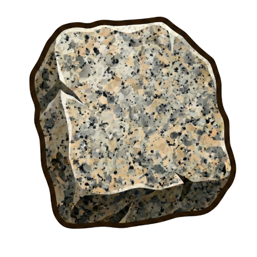
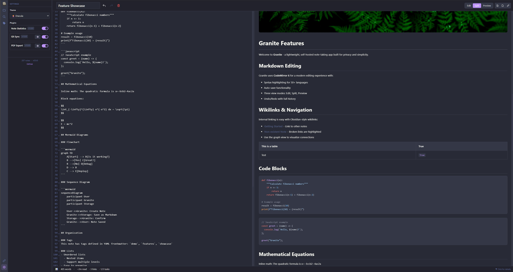

<div align="center">
  

  # Granite

  > Self-Hosted Markdown Note-Taking

  [](https://github.com/rrtjr/Granite/actions/workflows/test.yml)
  [](https://github.com/rrtjr/Granite/actions/workflows/docker-publish.yml)
  [](https://www.python.org/downloads/)
  [](https://opensource.org/licenses/MIT)
  [](VERSION)
</div>

A lightweight, self-hosted note-taking app with markdown support, wikilinks, tags, themes, and plugins. Your notes stay on your server as plain markdown files.

Forked from [NoteDiscovery](https://github.com/gamosoft/notediscovery).

**Why a fork?** I use this tool daily for my personal knowledge base, and I'm making changes as I see fit for my workflow. This allows me to iterate quickly on features and improvements that matter to me without waiting on upstream decisions. If you're looking for a more community-driven project, check out the original NoteDiscovery.



---

## Quick Start

### Docker Compose (Recommended)

```bash
git clone https://github.com/rrtjr/Granite.git granite
cd granite
docker-compose up -d
```

Access at [http://localhost:8000](http://localhost:8000)

**Security:** Authentication is disabled by default. If exposing to a network, see [AUTHENTICATION.md](documentation/AUTHENTICATION.md).

### Using Pre-built Image

```bash
docker pull ghcr.io/rrtjr/granite:latest
docker-compose -f docker-compose.ghcr.yml up -d
```

### Local Python

```bash
git clone https://github.com/rrtjr/Granite.git granite
cd granite
pip install -r requirements.txt
python run.py
```

Requires Python 3.10+. Access at [http://localhost:8000](http://localhost:8000)

---

## Features

- **Markdown editor** with syntax highlighting (CodeMirror 6)
- **Wikilinks** - `[[Note Name]]` internal linking
- **Tags & search** - YAML frontmatter tags with combined filtering
- **Themes** - 8 built-in themes plus custom theme support
- **Math & diagrams** - LaTeX/MathJax and Mermaid support
- **Spreadsheets** - Excel-like tables with formulas
- **Graph view** - Visualize note connections
- **Plugins** - Git Sync, PDF Export, Note Statistics
- **Templates** - Reusable note templates
- **Optional authentication** - Password protection when needed

## Documentation

Browse the [documentation/](documentation/) folder for detailed guides:

- [FEATURES.md](documentation/FEATURES.md) - Full feature list and keyboard shortcuts
- [AUTHENTICATION.md](documentation/AUTHENTICATION.md) - Enable password protection
- [PLUGINS.md](documentation/PLUGINS.md) - Plugin system and development
- [THEMES.md](documentation/THEMES.md) - Theme customization
- [API.md](documentation/API.md) - REST API reference
- [CONTRIBUTING.md](CONTRIBUTING.md) - Development and contributing guidelines

**Tip:** Mount the docs folder to view them in the app:
```yaml
volumes:
  - ./documentation:/app/data/docs:ro
```

## Contributing

Contributions welcome! See [CONTRIBUTING.md](CONTRIBUTING.md) for guidelines.

## License

MIT License - see [LICENSE](LICENSE)

---

<div align="center">

[Report Bug](https://github.com/rrtjr/Granite/issues) · [Request Feature](https://github.com/rrtjr/Granite/issues)

</div>
