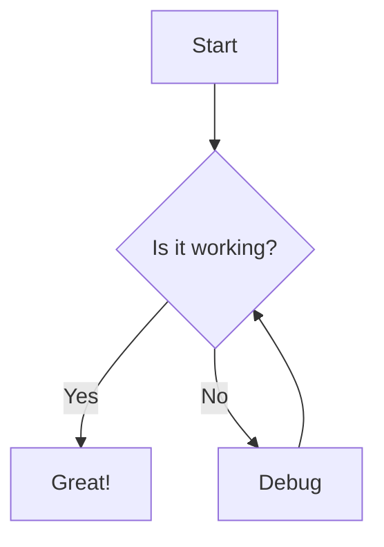

# Features

## Note Management

### Create & Edit
- **Rich markdown editor** with live preview
- **Three view modes**: Edit, Split, Preview
- **Auto-save** - Never lose your work
- **Undo/Redo** - Ctrl+Z / Ctrl+Y support
- **Note templates** - Create notes from templates with dynamic placeholders
- **Syntax highlighting** for code blocks (50+ languages)
- **Copy code blocks** - One-click copy button on hover
- **LaTeX/Math rendering** - Beautiful mathematical equations with MathJax (see [MATHJAX.md](MATHJAX.md))
- **Mermaid diagrams** - Create flowcharts, sequence diagrams, and more (see [MERMAID.md](MERMAID.md))

### Image Support
- **Drag & drop upload** - Drop images from your file system directly into the editor
- **Clipboard paste** - Paste images from clipboard with Ctrl+V
- **Multiple formats** - Supports JPG, PNG, GIF, and WebP (max 10MB)
- **Obsidian format** - Images use wiki-link format `![[image.png]]` for compatibility
- **Root folder storage** - Images saved to notes root directory for easy access

### Organization
- **Folder hierarchy** - Organize notes in nested folders
- **Drag & drop** - Move notes and folders effortlessly
- **Alphabetical sorting** - Find notes quickly
- **Rename anything** - Files and folders, instantly
- **Visual tree view** - Expandable/collapsible navigation

## Linking & Discovery

### Graph View
- **Interactive graph** - Visualize all your notes and their connections
- **Navigate with mouse** - Drag to pan, scroll to zoom, double-click nodes to open notes
- **Multiple link types** - See wikilinks and markdown links distinguished by color
- **Theme-aware** - Graph colors adapt to your current theme

### Internal Links
- **Wikilinks** - `[[Note Name]]` Obsidian-style syntax for quick linking
- **Wikilinks with display text** - `[[Note Name|Click here]]` to customize link text
- **Broken link detection** - Non-existent note links shown dimmed
- **Markdown links** - `[Note Name](note.md)` standard syntax also supported
- **Drag to link** - Drag notes or images into the editor to insert links
- **Click to navigate** - Jump between notes seamlessly
- **External links** - Open in new tabs automatically

### Direct URLs
- **Deep linking** - Open specific notes via URL (e.g., `/folder/note`)
- **Search highlighting** - Add `?search=term` to highlight specific content
- **Browser history** - Back/forward buttons navigate between notes
- **Shareable links** - Bookmark or share direct links to notes with highlighted terms
- **Refresh safe** - Page reload keeps you on the same note with search context
- **Copy link button** - One-click copy of note URL to clipboard

## Customization

### Themes
- **10 built-in themes** - Light, Dark, Dracula, Nord, Monokai, Vue High Contrast, Cobalt2, VS Blue, Gruvbox Dark, Matcha Light
- **Theme persistence** - Remembers your choice
- **Custom themes** - Create your own CSS themes
- **Instant switching** - No reload required

### Layout
- **Resizable sidebar** - Drag to adjust width
- **View mode memory** - Remembers Edit/Split/Preview preference
- **Responsive design** - Works on all screen sizes

## Settings

### Server-Side Settings Persistence
All user settings are stored server-side in `user-settings.json` at the root level. This means:
- **Survives Docker restarts** - Settings persist even when containers are restarted
- **Survives Docker rebuilds** - No need to reconfigure after rebuilds
- **Shared across devices** - Access the same settings from any browser or device
- **Version controllable** - Settings file can be backed up or version controlled
- **Hot-swap updates** - Changes take effect immediately without restart

### Reading Preferences
Customize your reading experience in Settings → Reading Preferences:
- **Content Width** - Narrow (650px), Medium (850px), Wide (1100px), or Full Width
- **Text Alignment** - Left aligned, Centered, or Justified
- **Content Spacing** - Compact, Normal, Relaxed, or Extra Relaxed

### Performance Tuning
Advanced settings for power users in Settings → Advanced Settings:
- **Editor Update Delay** (0-1000ms) - Delay before updating content on keystroke
- **Statistics Update Delay** (0-2000ms) - Delay before recalculating statistics
- **Metadata Parse Delay** (0-2000ms) - Delay before parsing metadata
- **Undo History Delay** (0-2000ms) - Delay before updating undo history
- **Autosave Delay** (500-10000ms) - Delay before triggering autosave
- **Reset to Defaults** - One-click restore of optimal settings

### Folders & Paths
Configure folder locations in Settings → Folders & Paths:
- **Templates Folder** - Set custom location for note templates (relative to notes directory or absolute path)
- **Hot-swap support** - Changes take effect immediately

### Plugin Settings
Plugin-specific settings are automatically persisted:
- **Git Plugin Settings** - Backup interval, auto-push, remote branch, etc.
- **PDF Export Settings** - Export configuration options
- **Settings UI** - Configure plugins through Settings panel
- **Automatic persistence** - Plugin settings saved to `user-settings.json`

### Automatic Migration
First-time setup automatically migrates any existing localStorage settings to the server-side system, ensuring a seamless transition.

## Note Statistics

### Built-in Plugin
- **Word count** - Track document length
- **Character count** - Including and excluding spaces
- **Reading time** - Estimated minutes to read
- **Line count** - Total lines in note
- **Image count** - Track embedded images
- **Link count** - Internal and external links (includes wikilinks)
- **Wikilink count** - Separate count for `[[wikilinks]]`
- **Expandable panel** - Toggle stats visibility

## Plugin System

### Extensibility
- **Easy installation** - Drop Python files in `plugins/` folder
- **Hot reload** - Plugins detected on app restart
- **Settings UI** - Manage all plugins from the Settings panel
- **Toggle on/off** - Enable/disable plugins with one click (no deletion needed)
- **Visual management** - See all installed plugins with name, version, and status
- **Event hooks** - React to note saves, deletes, searches
- **API access** - Full access to backend functionality

See [PLUGINS.md](PLUGINS.md) for complete plugin documentation including how to create your own plugins.

## Tags

Organize notes with tags defined in YAML frontmatter. See **[TAGS.md](TAGS.md)** for complete guide.

### Quick Start
```markdown
---
tags: [python, tutorial, backend]
---

# Your Note Content
```

### Features
- **Click to filter** - Select tags to show matching notes
- **Multiple tags** - Combine tags (AND logic - all must match)
- **Tag counts** - See how many notes use each tag
- **Collapsible panel** - Saves state across sessions
- **Auto-sync** - Updates after saving notes

## Note Properties Panel

View and interact with YAML frontmatter metadata directly in the preview.

### Features
- **Collapsible panel** - Compact bar at the top of preview, expands on click
- **Auto-hides** - Only appears when note has frontmatter
- **Clickable tags** - Filter notes by clicking any tag
- **Smart formatting** - Dates formatted nicely, booleans shown as checkmark/cross
- **URL detection** - Links in metadata are clickable
- **Real-time updates** - Changes as you edit frontmatter
- **Performance optimized** - Cached parsing, no re-parse if unchanged

### Collapsed View
Shows tags as pills plus up to 3 priority fields (date, author, status, etc.)

### Expanded View
Click to expand and see all metadata fields in a clean grid layout.

### Supported Formats
```yaml
---
tags: [project, important]     # Inline array
date: 2024-01-15               # Formatted as "Jan 15, 2024"
author: John Doe               # String value
status: draft                  # String value
priority: high                 # String value
source: https://example.com    # Clickable link
draft: true                    # Shows as "Yes"
custom-field: any value        # Keys with hyphens supported
items:                         # YAML list format
  - item 1
  - item 2
---
```

## Search & Filtering

### Text Search
- **Content-only** - Searches note contents (not file/folder names)
- **Real-time results** - As you type
- **Highlight matches** - See context in results
- **In-note highlighting** - Search terms highlighted in open notes
- **Live highlighting** - Highlights update as you type or edit

### Combined Filtering
- **Tags + Search** - Combine text search with tag filters
- **Smart display** - Shows flat list when filtering, tree view when browsing
- **Empty states** - Clear "no matches" message with quick actions

## Math & LaTeX Support

### Mathematical Notation
- **Inline math** - Use `$...$` or `\(...\)` for equations within text
- **Display math** - Use `$$...$$` or `\[...\]` for centered equations
- **Full LaTeX support** - Powered by MathJax 3
- **Greek letters** - `\alpha`, `\beta`, `\Gamma`, etc.
- **Matrices** - `\begin{bmatrix}...\end{bmatrix}`
- **Calculus** - Integrals, derivatives, limits
- **Symbols** - All standard mathematical symbols
- **Theme-aware** - Math colors adapt to your theme

### Example
```markdown
Einstein's equation: $E = mc^2$

The quadratic formula:
$$
x = \frac{-b \pm \sqrt{b^2-4ac}}{2a}
$$
```
Einstein's equation: $E = mc^2$

The quadratic formula:
$$
x = \frac{-b \pm \sqrt{b^2-4ac}}{2a}
$$

**See the [MATHJAX](MATHJAX.md) note for more examples and syntax reference.**

## Mermaid Diagrams

### Visual Diagrams
- **Flowcharts** - Process flows and decision trees
- **Sequence diagrams** - System interactions over time
- **Class diagrams** - UML class relationships
- **State diagrams** - State machines and transitions
- **Gantt charts** - Project timelines
- **Pie charts** - Data visualization
- **Git graphs** - Branch and commit history
- **Theme support** - Adapts to your theme

### Example
````markdown

````

**See the [MERMAID](MERMAID.md) note for diagram examples and syntax reference.**

## Note Templates

Create notes from reusable templates with dynamic placeholder replacement.

### Creating Templates
1. Create markdown files in `data/_templates/` folder
2. Use placeholders for dynamic content
3. Templates appear in the "New from Template" menu

### Available Placeholders
- `{{date}}` - Current date (YYYY-MM-DD)
- `{{time}}` - Current time (HH:MM:SS)
- `{{datetime}}` - Current date and time
- `{{timestamp}}` - Unix timestamp
- `{{title}}` - Note name (without extension)
- `{{folder}}` - Parent folder name

### Example Template
```markdown
---
tags: [meeting]
date: {{date}}
---

# {{title}}

**Created:** {{datetime}}

## Notes

```

### Using Templates
1. Click the "New" dropdown button
2. Select "New from Template"
3. Choose a template and enter a note name
4. The new note will be created with placeholders replaced

### Built-in Templates
- **meeting-notes** - Template for meeting notes
- **daily-journal** - Daily journal with morning goals and evening reflection
- **project-plan** - Project planning template with objectives and timeline

**See [TEMPLATES.md](TEMPLATES.md)** for detailed documentation and example templates you can copy to your instance.

## Keyboard Shortcuts

### General

| Windows/Linux | Mac | Action |
|---------------|-----|--------|
| `Ctrl+S` | `Cmd+S` | Save note |
| `Ctrl+Alt+N` | `Cmd+Option+N` | New note |
| `Ctrl+Alt+F` | `Cmd+Option+F` | New folder |
| `Ctrl+Z` | `Cmd+Z` | Undo |
| `Ctrl+Y` or `Ctrl+Shift+Z` | `Cmd+Y` or `Cmd+Shift+Z` | Redo |
| `F3` | `F3` | Next search match |
| `Shift+F3` | `Shift+F3` | Previous search match |

### Markdown Formatting

| Windows/Linux | Mac | Action | Result |
|---------------|-----|--------|--------|
| `Ctrl+B` | `Cmd+B` | Bold | `**text**` |
| `Ctrl+I` | `Cmd+I` | Italic | `*text*` |
| `Ctrl+K` | `Cmd+K` | Insert link | `[text](url)` |
| `Ctrl+Alt+T` | `Cmd+Option+T` | Insert table | 3x3 table placeholder |

## Performance

- **Instant loading** - No lag, no loading spinners
- **Efficient caching** - Smart local storage
- **Minimal resources** - Runs on modest hardware
- **No bloat** - Focused on what matters

---

**Tip:** Explore the interface! Most features are discoverable through intuitive drag & drop and hover menus.

